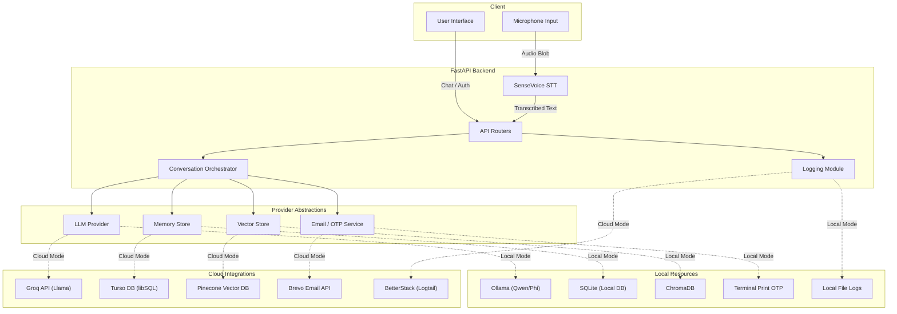

# Serinity System Architecture

Serinity is designed as a modular multi-agent system with a **Dual-Environment Architecture**. Depending on the `CLOUD_MODE` environment toggle, the system operates either entirely on-device (prioritizing 100% data privacy and offline capability) or leverages cloud infrastructure (prioritizing scalability, remote databases, and advanced LLMs).

## System Diagram

## Agentic Workflow Deep Dive

Serinity replaces the traditional single-prompt chatbot approach with a **Multi-Agent Pipeline** to ensure clinical rigor:

### 1. Agent 1: The Clinical Interviewer (Frontend Facing)
- **Role:** Handles the immediate conversation, builds rapport, and applies the "Therapeutic Alliance" rules. 
- **Mechanism:** It reads the user's message and outputs strict JSON defining an `intent` (CONTINUE, QUERY, or ANALYZE) and an `assistant_message`. It is strictly forbidden from offering unsolicited advice.

### 2. Agent 2: The Pattern Analyst (Conditional Trigger)
- **Role:** Only triggered when Agent 1 determines enough substantive dialogue has occurred (Intent = ANALYZE).
- **Mechanism:** It performs a "delta analysis" between the user's historical profile and the current session, searching for emerging risk factors or changes in emotional themes without breaking the conversational flow.

### 3. Agent 3: The Profile Manager (Background Worker)
- **Role:** Maintains longitudinal memory.
- **Mechanism:** After the session ends or at set intervals, this agent runs in the background. It reads the session transcript and updates the user's permanent JSON profile across 8 specific domains (e.g., `emotional_themes`, `protective_factors`). It ensures the bot "remembers" the patient's history in future sessions without needing a massive context window.

## Dual-Environment Component Matrix

Serinity can dynamically route requests based on the `CLOUD_MODE` environment variable.

| Component           | Local Mode (`CLOUD_MODE=false`) | Cloud Mode (`CLOUD_MODE=true`) |
| :--------------------| :------------------------------| :-------------------------------|
| **LLM Inference**   | Ollama (Local device)         | Groq API                       |
| **Vector Database** | ChromaDB (Local filesystem)   | Pinecone API                   |
| **Relational DB**   | SQLite (`.db` file)           | Turso (libSQL API)             |
| **Logging**         | File logs (`./logs`)          | BetterStack (Logtail API)      |
| **OTP / Auth**      | Terminal stdout print         | Brevo API (SMTP/Email)         |
| **Frontend UI**     | Vanilla HTML/JS (localhost)   | Vanilla HTML/JS                |
| **Speech-to-Text**  | SenseVoice (Local device)     | *(Currently Local only)*       |
