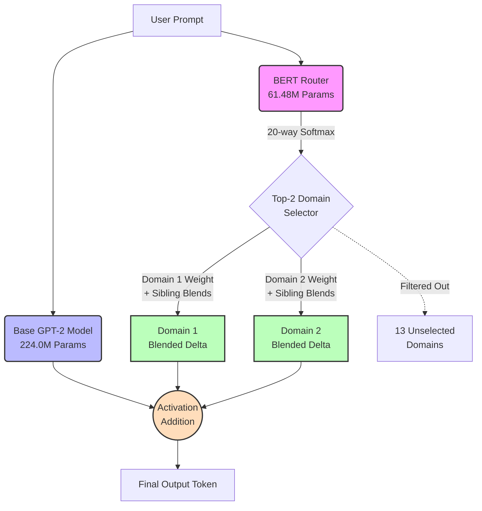

# 🧠 nanoRush-500: Macro Mixture of Experts (MoE) Architecture & Master Plan

This document outlines the complete end-to-end architecture, hyperparameter specifications, training pipeline, and evaluation strategy for the nanoRush-500 project. The system is designed to achieve state-of-the-art multi-domain performance while remaining small enough to run inference entirely on a single consumer GPU (12GB VRAM).

---

## 1. System Architecture Overview

The system utilizes a **Macro Mixture of Experts (MoE)** architecture via dynamic LoRA merging. Instead of a single monolithic model, it relies on three distinct components:
1. **The Base Generative Model:** A 224M parameter GPT-2 class model, deeply scaled to 28 layers.
2. **The BERT Router:** A ~61.48M parameter encoder model (14-layer BERT architecture, 512 hidden, mapped to the shared 32k vocab) used for prompt classification.
3. **The Expert Adapters:** 20 domain-specific LoRA adapters. Factual domains utilize Attn+MLP targeting, while structural/tonal domains utilize Attention-only targeting.

**Final System Specification:**
| Component | Spec | Params |
| :--- | :--- | :--- |
| **Base model** | 28-layer GPT-2 class, 768 hidden, 12 heads, 2048 ctx, 32k vocab | 224.0M |
| **BERT Router** | 14-layer, 512 hidden, 8 heads, 32k vocab (shared tokenizer) | 61.48M |
| **20 LoRA adapters** | Mixed r=16/32/64, Attn-only or Attn+MLP by domain | 214.69M |
| **Total** | | **≈500.2M ("0.5B")** |

**Active Inference Footprint:** ~225M to 262.5M parameters (Varies dynamically based on whether the Router selects lightweight Attention-only or heavyweight Attn+MLP adapters).

### 1.1 Architecture Diagram

---

## 2. Phase 1: The Generative Base Model (224M)

### 2.1 Model Specifications (Deep GPT-2 Architecture)
*   **Layers (`n_layer`):** 28
*   **Attention Heads (`n_head`):** 12
*   **Embedding Dimension (`n_embd`):** 768
*   **Context Window (`block_size`):** 2048 tokens
*   **Vocabulary Size:** 32,000 (Custom Trained Tokenizer)
*   **Parameters:** ~224M
*   **Optimizations:** Flash Attention via `scaled_dot_product_attention`, learned absolute positional encoding, weight tying between token embedding and `lm_head`.

### 2.2 Pretraining Dataset (`build_dataset.py`)
To ensure a robust, multi-domain foundational vocabulary, the dataset streams from a massive pre-compiled text corpus:
*   **Dataset Size:** 18 GB
*   **Token Count:** 4.5 Billion Tokens

### 2.3 Training Dynamics
*   **Compute:** NVIDIA RTX 3060 12GB.
*   **Batching:** Micro-batch of 1 × Grad Accumulation of 40 × 2048 block size = **81,920 tokens per update**.
*   **Training Scale:** `150,000` maximum iterations yielding ~**12.3 Billion tokens** total. This provides a ~2.7x Chinchilla over-training multiplier (Chinchilla optimal for 224M is ~4.5B tokens). *(Note: This is consistent with resource-constrained small-model precedent; well-funded efforts like SmolLM2 push 200-700x with cluster-scale compute. 2.7x explicitly reflects our single-3060, 4-week hardware constraint rather than a theoretical capability ceiling).*
*   **Precision:** Mixed precision `bfloat16` with TF32 enabled.
*   **Optimizer:** Fused AdamW, Peak LR: `6e-4`, Weight decay: `0.1`, Gradient clipping: `1.0`.
*   **Schedule:** Cosine learning rate decay (2,000 warmup steps, decaying down to `6e-5`).

---

## 3. Phase 2: Instruction Fine-Tuning (SFT)

Before attaching domain experts, the raw Base Model must learn to chat.
*   **Dataset:** `alpaca_data_cleaned.json` (~52,000 instruction-response pairs).
*   **Training Duration:** Exactly **3 epochs**.
*   **Result:** The Base Model becomes the "Chat Model".
*   **Post-SFT Forgetting Check:** To verify the base model hasn't catastrophically forgotten its world knowledge during instruction tuning, the original Phase 1 per-domain perplexity evaluation will be re-run on the Chat Model to confirm performance has not degraded significantly.

---

## 4. Phase 3: The Expert LoRA Adapters

To build the Mixture of LoRAs, we will train specific Low-Rank Adaptation (LoRA) matrices on top of the Chat Model. 

### 4.1 Adapter Configuration
*   **Target Layers (Dynamic Selection):** 
    *   *Factual & Reasoning Domains* (Medical, Legal, STEM, History, Math, Cybersecurity, SQL, Code, Finance, Multilingual) will target both Attention + MLP (`q_proj`, `v_proj`, `c_fc`, `c_proj`). This applies established findings (e.g., Geva et al. 2021) that Transformer FFNs behave as key-value memories for factual associations, which literature shows is particularly critical for preventing degradation on reasoning benchmarks like GSM8K and semantic logic queries.
    *   *Structural/Tonal Domains* (Chat, Creative, Psychology, Support, Ethics) will target Attention-only (`q_proj`, `v_proj`) to control logic and syntax formatting without risking catastrophic interference of the base model's world knowledge.
*   **Ranks (r):** Variable based on domain complexity (r=64 for complex logic/facts, r=32 for standard structure, r=16 for conversational tone).
*   **Epochs:** Scaled proportionally to adapter complexity to prevent overfitting (5 epochs for r=64, 4 epochs for r=32, and strictly 3 epochs for r=16).
*   **Quantization:** For future scaling, we will experiment with `int8` quantization of the base model to free up VRAM for even more adapters. *(Note: This will require an explicit upcast/dequantization step during inference before summing the `bfloat16` LoRA activations with the `int8` base model activations).*

### 4.2 The Industry-Grade Datasets (20 Adapters)
*(Note: Because the base model is 28 layers deep, adapter parameter sizes scale linearly with depth.)*
| Domain                                | Adapter Dataset                                                                                                        | Rank (`r`) | Target    | Params |
| :--------------------------------------| :-----------------------------------------------------------------------------------------------------------------------| :-----------| :----------| :-------|
| **1. Code (Syntax & Algorithms)**     | [Evol-Instruct](https://huggingface.co/datasets/nickrosh/Evol-Instruct-Code-80k-v1)                                    | 64         | Attn+MLP  | 19.27M |
|                                       | [Magicoder](https://huggingface.co/datasets/ise-uiuc/Magicoder-OSS-Instruct-75K)                                       | 64         | Attn+MLP  | 19.27M |
|                                       | [CodeAlpaca](https://huggingface.co/datasets/sahil2801/CodeAlpaca-20k)                                                 | 32         | Attn+MLP  | 9.63M  |
| **2. Math (Chain of Thought)**        | [MetaMathQA](https://huggingface.co/datasets/meta-math/MetaMathQA)                                                     | 64         | Attn+MLP  | 19.27M |
|                                       | [OpenOrca](https://huggingface.co/datasets/Open-Orca/OpenOrca)                                                         | 32         | Attn+MLP  | 9.63M  |
| **3. Medical (Clinical & Facts)**     | [MedAlpaca](https://huggingface.co/datasets/medalpaca/medical_meadow_medical_flashcards)                               | 64         | Attn+MLP  | 19.27M |
|                                       | [ChatDoctor](https://huggingface.co/datasets/Luoapp/ChatDoctor)                                                        | 32         | Attn+MLP  | 9.63M  |
| **4. Finance (Business Logic)**       | [Finance-Alpaca](https://huggingface.co/datasets/gbharti/finance-alpaca)                                               | 32         | Attn+MLP  | 9.63M  |
| **5. General (Conversational)**       | [OpenHermes 2.5](https://huggingface.co/datasets/teknium/OpenHermes-2.5)                                               | 32         | Attn-only | 2.75M  |
|                                       | [Capybara](https://huggingface.co/datasets/LDJnr/Capybara)                                                             | 32         | Attn-only | 2.75M  |
| **6. Legal (Structured Jargon)**      | [Joelito Legal Instruction](https://huggingface.co/datasets/joelito/legal-instruction-tuning)                          | 32         | Attn+MLP  | 9.63M  |
| **7. STEM (Physics/Chemistry)**       | [Camel-AI Physics & Chemistry](https://huggingface.co/datasets/camel-ai/physics)                                       | 64         | Attn+MLP  | 19.27M |
| **8. Creative (Roleplay/Fiction)**    | [Airoboros](https://huggingface.co/datasets/jondurbin/airoboros-2.2)                                                   | 16         | Attn-only | 1.38M  |
| **9. Cybersecurity (Hacking/SecOps)** | [Cybersecurity Alpaca](https://huggingface.co/datasets/tatsu-lab/alpaca)                                               | 64         | Attn+MLP  | 19.27M |
| **10. Multilingual (Translation)**    | [Cohere Aya](https://huggingface.co/datasets/CohereForAI/aya_dataset)                                                  | 32         | Attn+MLP  | 9.63M  |
| **11. Psychology (Mental Health)**    | [Psychology-10k](https://huggingface.co/datasets/samhog/psychology-10k)                                                | 16         | Attn-only | 1.38M  |
| **12. Data Science (SQL)**            | [SQL-Create-Context](https://huggingface.co/datasets/b-mc2/sql-create-context)                                         | 64         | Attn+MLP  | 19.27M |
| **13. History (Factual Recall)**      | [Wikipedia QA](https://huggingface.co/datasets/Tevatron/wikipedia-qa)                                                  | 32         | Attn+MLP  | 9.63M  |
| **14. Ethics (Safety/Alignment)**     | [Anthropic HH-RLHF](https://huggingface.co/datasets/Anthropic/hh-rlhf)                                                 | 32         | Attn-only | 2.75M  |
| **15. Customer Support (Tone)**       | [Bitext Customer Support](https://huggingface.co/datasets/bitext/Bitext-customer-support-llm-chatbot-training-dataset) | 16         | Attn-only | 1.38M  |

### 4.3 Master Hyperparameter Table
| Component | Hyperparameter | Value | Description |
| :--- | :--- | :--- | :--- |
| **Base Model** | Layers / Hidden / Heads | 28 / 768 / 12 | Deep, narrow GPT-2 architecture |
| | Vocab Size / Context | 32,000 / 2048 | Custom tokenizer |
| **BERT Router** | Layers / Hidden / Heads | 14 / 512 / 8 | Deeper classification engine |
| | Output Labels / Classes | 20 | "Double Duty" tracking every adapter |
| **LoRA Adapters**| Code, Math, STEM, Medical | `r=64`, Attn+MLP | Massive capacity for hard factual recall |
| | Legal, Finance, History, SQL | `r=32`, Attn+MLP | Strong capacity for structured facts |
| | General Chat, Align, Creative | `r=32` & `r=16`, Attn-only | Lightweight structural/tonal formatting |
| **Inference Config**| `router_top_k` | 2 | Max domains selected per prompt |
| *(User Tunable)*| `router_threshold` | 0.15 | Minimum confidence to trigger adapter |
| | `fallback_domain` | "General Chat" | Used if all scores fall below threshold |
| | `lora_alpha_multiplier` | 1.0 | Scales the strength of adapter activations |

> **CRITICAL: Benchmark Decontamination**
> Before Phase 3 training, an n-gram decontamination script must be run against all evaluation sets (BLiMP, HellaSwag, GSM8K) to ensure test data did not leak into the adapter training data.

---

## 5. Phase 4: The BERT Router (~61.48M)

An encoder-only model (14 layers, 8 heads, 512 hidden size, 32,000 custom vocab size) designed to classify user prompts. Crucially, the router performs a **"Double Duty" 20-way classification**, treating every single adapter (e.g., Evol-Instruct vs. Magicoder) as an independent label. This gives us the fine-grained signal needed for "True MoE" blending, without sacrificing the safety of Domain-level routing.
*   **Proxy Capacity Test:** Before full pretraining, a randomly initialized 61.48M model will be quickly fine-tuned on the routing dataset as a cheap sanity check to verify sufficient classification capacity.
*   **Pretraining:** Uses the exact same `corpus.txt` built in Phase 1, but bounded to Chinchilla scaling laws for ~61M parameters, preserving the base model's compute budget.
*   **Fine-Tuning:** Downsampled stratified training (~16,000 rows extracted from *each* of the 20 adapter datasets). An explicit 80/10/10 Train/Val/Test split will be maintained (decontaminated against downstream evals) to ensure the reported Router Accuracy is completely honest and unbiased.

---

## 6. Dynamic Inference Logic (The "Double Duty Macro MoE")

1.  **Classification (20-way):** The 61.48M BERT Router processes the prompt and outputs 20 Softmax probabilities (one for each individual adapter).
2.  **Domain Collapse (Step A):** The system maps the 20 probabilities to their 15 parent Domains by summing sibling probabilities (e.g., `Code_Prob = p_Evol + p_Magicoder + p_Alpaca`).
3.  **Filtering (Top-2 Threshold):** The system ignores Domain probabilities below 15% and strictly selects a maximum of the top 2 **Domains**. 
    *   **Domain Renormalization:** The remaining top-2 domain probabilities (e.g., 55% Code and 20% Math) must be explicitly renormalized so they sum to 1.0 (e.g., `Code_Weight = 0.55 / 0.75`).
    *   **Fallback Policy:** If *all* probabilities fall below the 15% threshold (ambiguous prompt), the router defaults exclusively to the **General Adapter** with 100% weight to guarantee a safe, standard response.
4.  **Prompt-Conditioned Intra-Domain Blending (Step B):** For the selected Top-2 Domains, if a domain contains multiple sibling adapters, we use the router's raw adapter probabilities to dynamically blend them. *This step short-circuits and is completely skipped for the 13 unselected domains to save compute. For single-adapter domains (e.g., Legal, Finance), Step B is a no-op; the domain's blended delta is simply that single adapter's delta with weight 1.0.*
    *   **Intra-Domain Renormalization:** The raw sibling probabilities must be renormalized internally so they sum to 1.0 within their domain. For example, if `p_Evol = 0.3`, `p_Magicoder = 0.2`, and `p_Alpaca = 0.1`, then `Evol_Internal_Weight = 0.3 / 0.6 = 0.5`. 
    *   **Merging:** The internal Code Delta becomes `(0.5 * Evol) + (0.33 * Magicoder) + (0.17 * CodeAlpaca)`.
5.  **Dynamic On-the-Fly Computation (S-LoRA Approach):** To avoid latency bottlenecks, we use activation addition. The base model weights remain frozen.
6.  **Generation Formula:** 
    `Output = (X @ W_base) + [Domain1_Weight * (X @ Domain1_Blended_Delta)] + [Domain2_Weight * (X @ Domain2_Blended_Delta)]`
7.  **Throughput Targets:** The goal is to hit **>30 tokens/sec** during inference with max VRAM usage peaking under **10 GB**.

---

## 7. Evaluation & Benchmarking Strategy

Evaluating a 224M parameter model on billion-scale benchmarks (MMLU, GPQA) yields random chance. nanoRush-500 will be evaluated using the industry-standard Sub-1B Benchmark Suite (BabyLM-style metrics), prioritizing ablations to prove the architecture's worth.

### 7.1 Primary Capability Diagnostics
*   **Per-Domain Perplexity:** The ultimate test. We will measure bits-per-byte/perplexity on held-out data specifically targeting Code, Math, and General text.
*   **BLiMP & EWoK:** Zero-shot linguistic and reasoning diagnostics specifically designed for sub-1B models to test core grammar and world knowledge.
*   **HellaSwag & ARC-Easy:** Unlike ARC-Challenge, these provide realistic targets and meaningful performance gaps for a 224M model.
*   **GSM8K & HumanEval-Easy:** Tested as "stretch goals". Expectations are low, but this will prove if the Code/Math LoRAs move the needle versus the base model.

### 7.2 Ablation Studies (Proving the Architecture)
To prove that our Macro MoE actually works and isn't just "brown paint," we must compare three baselines on the exact same prompts:
1.  **Baseline A:** Chat Model with NO LoRA.
2.  **Baseline B:** Chat Model + Single Best-Matching LoRA (no blending).
3.  **nanoRush-500 MoE:** The full Top-2 weighted blend.
*If nanoRush-500 MoE consistently scores higher on HellaSwag/Perplexity than Baseline B across multiple training seeds (tracked via strict seed-fixing and logged to W&B/TensorBoard for perfect reproducibility), we have strong empirical evidence that probability-weighted activation addition successfully synthesizes domain knowledge. We will honestly report per-domain breakdowns, even in cases where the MoE underperforms.*

### 7.3 Router Metrics
Because the router performs "Double Duty," accuracy must be reported at two distinct levels on the held-out test split:
*   **Domain-Level Accuracy (15-way):** Evaluated after the Step A collapse. This is the safety-critical metric that catches hard misroutes (e.g., sending a Code prompt to the Medical domain).
*   **Sibling-Level Calibration (Within-Domain):** Evaluates if the raw 20-way logits dynamically shift correctly among siblings (e.g., does `p_Alpaca` spike relative to `p_Evol` on simple code queries?). This metric proves whether Step B's prompt-conditioned blending is extracting genuine signal or just adding random noise.

### 7.4 Preference Benchmarks
*   **Unified Elo Rating:** Measuring how often human judges (or LLM-as-a-judge) prefer nanoRush-500's formatting and helpfulness over our own **Baseline A (SFT Chat Model)** or comparable external models like Qwen 0.5B-Chat. *(Note: Comparing Elo against a non-instruction-tuned base GPT-2 is not a fair benchmark).*

---

## 8. Responsible Release & Licensing

*   **Licensing Audit:** Before publishing model weights to Hugging Face, a full license audit must be performed on the training datasets (e.g., MedAlpaca and Magicoder variants frequently carry strict non-commercial/research-only terms).
*   **Medical Adapter Disclaimer:** A 224M model with a Medical LoRA will confidently hallucinate clinical jargon without possessing genuine medical reasoning capability. A highly visible disclaimer specifically warning against real-world medical use must be included in the release repository.
