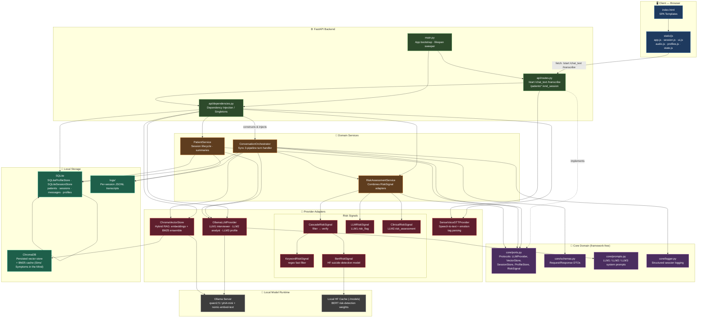
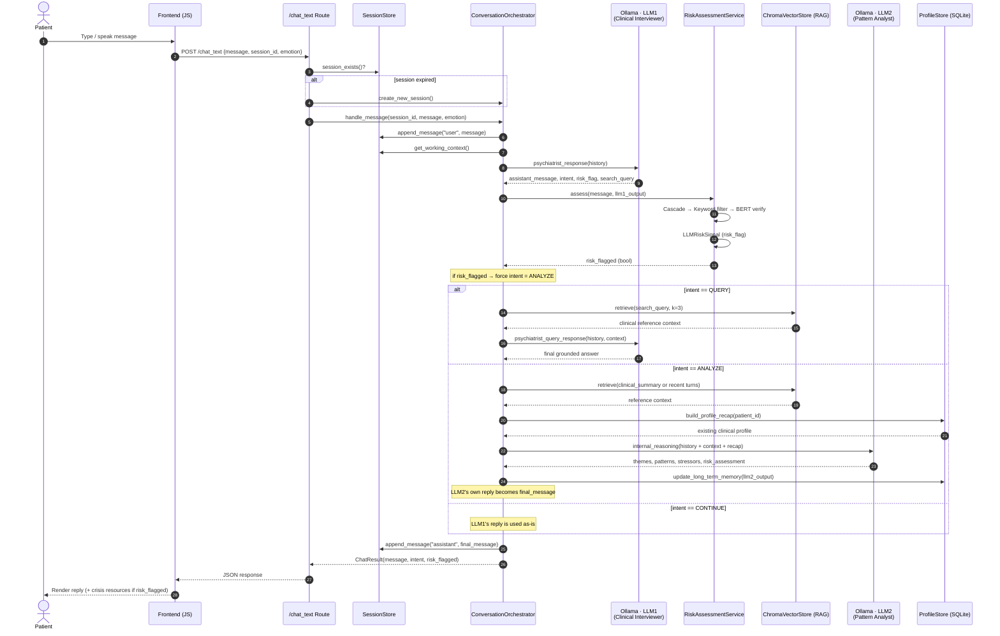
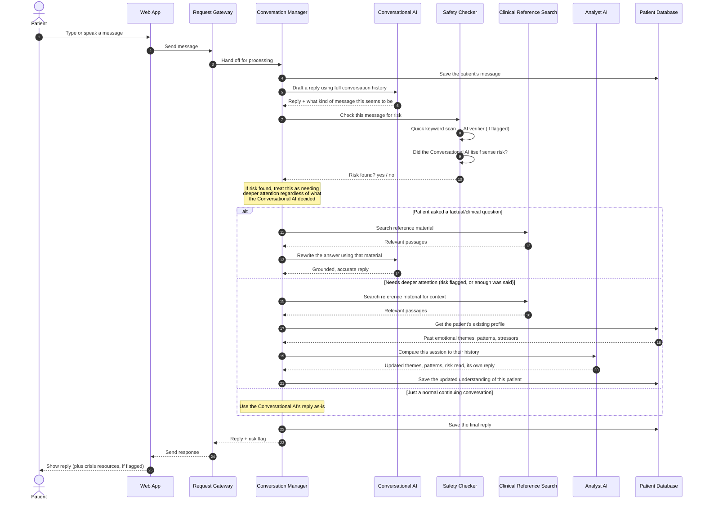
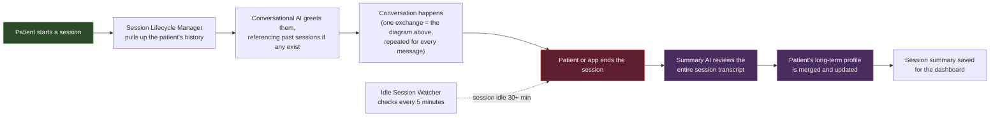

```mermaid
graph TB
    User(["🧑 Patient"])

    subgraph FRONTEND["Web App"]
        UI["Chat Interface<br/>(text + voice)"]
        DASH["Patient Dashboard<br/>(profile & session history)"]
    end

    subgraph SERVER["Backend Server"]
        GATEWAY["Request Gateway<br/>receives every action the patient/app takes"]
        WIRING["Startup Wiring<br/>builds and connects all the pieces below when the server boots"]
        SWEEPER["Idle Session Watcher<br/>auto-closes sessions left open too long"]
    end

    subgraph LOGIC["Core Conversation Logic"]
        ORCH["Conversation Manager<br/>runs every chat turn end-to-end"]
        LIFECYCLE["Session Lifecycle Manager<br/>starts sessions, ends sessions,<br/>triggers the after-session summary"]
        SAFETY["Safety Checker<br/>combines multiple checks into one yes/no risk decision"]
    end

    subgraph SIGNALS["Safety Checker's Individual Checks"]
        FASTFILTER["Quick Keyword Scan<br/>catches obvious phrases instantly"]
        DEEPCHECK["AI Verifier Model<br/>double-checks anything the quick scan flags"]
        SELFREPORT["Conversational AI's Own Judgment<br/>did it sense risk while replying?"]
        CLINICALCHECK["Analyst AI's Clinical Read<br/>did the deeper pattern review find risk?"]
    end

    subgraph MODELS["Local AI Models (via Ollama)"]
        CHAT_AI["Conversational AI<br/>talks with the patient in real time"]
        ANALYST_AI["Analyst AI<br/>studies emotional/behavioral patterns"]
        SUMMARY_AI["Summary AI<br/>writes the end-of-session clinical notes"]
    end

    subgraph SUPPORT["Supporting Local Services"]
        VOICE_AI["Speech-to-Text Engine<br/>converts voice recordings to text + detects tone"]
        LIBRARY["Clinical Reference Search<br/>retrieves relevant passages from<br/>psychiatric reference material"]
    end

    subgraph STORAGE["Stored on This Computer"]
        DB["Patient Database<br/>profiles, sessions, chat history, long-term memory"]
        VECDB["Reference Material Index<br/>pre-processed clinical text, searchable by meaning"]
        LOGS["Session Logs<br/>full transcript of every decision made"]
    end

    User --> UI
    User --> DASH
    UI -->|"send message"| GATEWAY
    UI -->|"voice recording"| GATEWAY
    DASH -->|"view/manage patients"| GATEWAY

    WIRING -.builds & connects.-> GATEWAY
    WIRING -.builds & connects.-> ORCH
    WIRING -.builds & connects.-> LIFECYCLE
    WIRING -.builds & connects.-> SAFETY
    SWEEPER -->|"every 5 min, close stale sessions"| LIFECYCLE

    GATEWAY -->|"new chat message"| ORCH
    GATEWAY -->|"voice audio"| VOICE_AI
    GATEWAY -->|"start / end session"| LIFECYCLE
    GATEWAY -->|"patient CRUD"| DB

    ORCH -->|"1 · draft a reply"| CHAT_AI
    ORCH -->|"2 · check for risk"| SAFETY
    ORCH -->|"3a · answer a factual question"| LIBRARY
    ORCH -->|"3b · analyze deeper patterns"| ANALYST_AI
    ORCH -->|"save each message"| DB
    ORCH --> LOGS

    SAFETY --> FASTFILTER
    FASTFILTER -->|"only if flagged"| DEEPCHECK
    SAFETY --> SELFREPORT
    SAFETY --> CLINICALCHECK

    LIFECYCLE -->|"opening greeting"| CHAT_AI
    LIFECYCLE -->|"recall patient history"| DB
    LIFECYCLE -->|"after session ends"| SUMMARY_AI
    SUMMARY_AI -->|"updated profile"| DB
    LIFECYCLE --> LOGS

    VOICE_AI -->|"transcribed text"| GATEWAY
    LIBRARY --> VECDB

    classDef user fill:#1e3a5f,stroke:#4a90d9,color:#fff
    classDef frontend fill:#1e3a5f,stroke:#4a90d9,color:#fff
    classDef server fill:#2d4a2b,stroke:#5cb85c,color:#fff
    classDef logic fill:#5f3d1e,stroke:#e67e22,color:#fff
    classDef signals fill:#5f1e2d,stroke:#e74c3c,color:#fff
    classDef models fill:#4a2d5f,stroke:#9b59b6,color:#fff
    classDef support fill:#4a2d5f,stroke:#9b59b6,color:#fff
    classDef storage fill:#1e5f4a,stroke:#1abc9c,color:#fff

    class User user
    class UI,DASH frontend
    class GATEWAY,WIRING,SWEEPER server
    class ORCH,LIFECYCLE,SAFETY logic
    class FASTFILTER,DEEPCHECK,SELFREPORT,CLINICALCHECK signals
    class CHAT_AI,ANALYST_AI,SUMMARY_AI models
    class VOICE_AI,LIBRARY support
    class DB,VECDB,LOGS storage
```

# Serinity — System Architecture & Workflow

Serinity is a **local-first, multi-agent conversational AI** for clinical mental-health interviews, built as a FastAPI backend with a hexagonal (ports & adapters) core, a vanilla-JS frontend, and fully offline model inference via Ollama.

---

## 1. System Architecture

The codebase follows a **ports & adapters** style: `core/ports.py` defines abstract interfaces (`LLMProvider`, `VectorStore`, `SessionStore`, `ProfileStore`, `STTProvider`, `RiskSignal`), `services/` contains the framework-free business logic, and `providers/` + `persistence/` supply concrete local implementations. `api/dependencies.py` wires everything together as singletons and injects them into the FastAPI routes.

**Key design points**

- **Hexagonal core**: `services/` never imports FastAPI or a concrete database driver — only the `Protocol` interfaces in `core/ports.py`. Any adapter (e.g. swap Ollama for another LLM host) can be replaced without touching business logic.
- **Singletons via DI**: `api/dependencies.py` builds every provider and service once at import time and exposes `get_*()` functions that FastAPI routes consume with `Depends(...)`.
- **100% local**: LLM inference (Ollama), embeddings (`nomic-embed-text`), the vector store (ChromaDB), the risk-detection BERT model, and all patient data (SQLite) run on-device — no data leaves the machine.

---

## 2. Chat Turn Workflow

Every user message flows through `ConversationOrchestrator.handle_message`, which runs a **synchronous 3-pipeline** logic: a fast conversational agent (LLM1), an optional query/RAG path, and an optional deep pattern-analysis agent (LLM2) — gated by intent and risk signals.

### Session lifecycle (start → end → background summary)

```mermaid
flowchart LR
    A["POST /start"] --> B["PatientService.create_new_session"]
    B --> C["ProfileStore.build_profile_recap"]
    C --> D["LLM1.generate_opening_context + psychiatrist_response"]
    D --> E["Opening message returned to patient"]

    E -.-> F["... chat turns via /chat_text ..."]

    F --> G["POST /end_session"]
    G --> H["SessionStore.end_session (sync)"]
    G --> I["BackgroundTasks: generate_session_summary"]
    I --> J["LLM3: generate_end_of_session_profile<br/>(old profile + session transcript)"]
    J --> K["ProfileStore.update_patient_profile<br/>+ update_long_term_memory"]
    J --> L["SessionStore.save_session_summary"]

    M["Lifespan Sweeper<br/>every 5 min"] --> N["sweep_abandoned_sessions<br/>(idle > 30 min)"]
    N --> G

    style A fill:#2d4a2b,stroke:#5cb85c,color:#fff
    style G fill:#5f1e2d,stroke:#e74c3c,color:#fff
    style J fill:#4a2d5f,stroke:#9b59b6,color:#fff
    style M fill:#3d3d3d,stroke:#bdbdbd,color:#fff
```

---

## 3. Component Reference

| Layer | File(s) | Responsibility |
|---|---|---|
| Entry point | `main.py` | FastAPI app, CORS, static mount, lifespan-managed session sweeper |
| API | `api/routes.py`, `api/dependencies.py` | HTTP endpoints + singleton wiring/DI |
| Core contracts | `core/ports.py`, `core/schemas.py`, `core/prompts.py`, `core/logger.py` | Protocols, DTOs, LLM prompt templates, structured logging |
| Orchestration | `services/conversation_orchestrator.py` | Per-turn pipeline: LLM1 → risk → QUERY/ANALYZE branch |
| Session lifecycle | `services/patient_service.py` | Start/end sessions, background LLM3 summary generation, idle sweeping |
| Risk | `services/risk_assessment_service.py`, `providers/*_risk_signal.py` | Multi-signal safety net (keyword → BERT cascade, LLM self-report, LLM2 clinical judgment) |
| LLM | `providers/ollama_llm_provider.py` | Local Ollama calls for LLM1 (interviewer), LLM2 (analyst), LLM3 (profile writer) |
| RAG | `providers/chroma_vector_store.py`, `scripts/build_vector_db.py` | Hybrid (embedding + BM25) retrieval over psychiatric reference text |
| Speech | `providers/sensevoice_stt_provider.py` | Audio → text + emotion/event tag parsing |
| Persistence | `persistence/sqlite_memory_store.py` | SQLite-backed `ProfileStore` and `SessionStore` |
| Frontend | `templates/index.html`, `static/js/*`, `static/css/style.css` | SPA: chat UI, mic recording, patient profile dashboard |

> Diagrams render automatically on GitHub/GitLab (Mermaid support built in) or in any Markdown viewer with Mermaid enabled, e.g. the [Mermaid Live Editor](https://mermaid.live).

# Serinity — System Architecture & Workflow

Serinity is an offline-first, multi-agent AI system that conducts supportive mental-health conversations, tracks patients across sessions, and continuously screens for safety risks — with everything running locally on one machine.

---

## 1. System Architecture

---

## 2. How One Chat Message Is Handled

---

## 3. Session Lifecycle

---

## 4. Component Reference

Every plain-language box above maps to real code — use this table when you need to go find or modify something.

| Diagram Name | What It Does | Code |
|---|---|---|
| Web App (Chat Interface / Dashboard) | The page the patient interacts with | `templates/index.html`, `static/js/*`, `static/css/*` |
| Request Gateway | Receives every HTTP request from the web app | `api/routes.py` |
| Startup Wiring | Builds every service/provider once and injects them into the routes | `api/dependencies.py` |
| Idle Session Watcher | Background loop that auto-ends abandoned sessions | `main.py` (lifespan task) |
| Conversation Manager | Orchestrates one chat turn: draft → check risk → branch by intent | `services/conversation_orchestrator.py` |
| Session Lifecycle Manager | Starts/ends sessions, triggers the post-session summary | `services/patient_service.py` |
| Safety Checker | Combines all risk checks into one decision | `services/risk_assessment_service.py` |
| Quick Keyword Scan → AI Verifier | Fast regex filter, then a BERT model double-checks anything flagged | `providers/keyword_risk_signal.py` → `providers/bert_risk_signal.py`, chained by `providers/cascade_risk_signal.py` |
| Conversational AI's Own Judgment | Uses the risk flag the chat model set while replying | `providers/llm_risk_signal.py` |
| Analyst AI's Clinical Read | Uses the risk assessment from the deeper pattern-analysis model | `providers/clinical_risk_signal.py` |
| Conversational AI | The model that talks to the patient in real time (a.k.a. "LLM1") | `providers/ollama_llm_provider.py` |
| Analyst AI | The model that studies patterns across the conversation (a.k.a. "LLM2") | same file, different method |
| Summary AI | The model that writes end-of-session clinical notes (a.k.a. "LLM3") | same file, different method |
| Speech-to-Text Engine | Converts voice recordings to text and detects vocal tone | `providers/sensevoice_stt_provider.py` |
| Clinical Reference Search | Finds relevant passages from psychiatric reference material | `providers/chroma_vector_store.py` |
| Patient Database | Stores patients, sessions, messages, and long-term profiles | `persistence/sqlite_memory_store.py` (SQLite) |
| Reference Material Index | Pre-processed, searchable copy of the reference library | ChromaDB + BM25 cache, built by `scripts/build_vector_db.py` |
| Session Logs | Full JSONL trace of every decision made per session | `core/logger.py` |
| (shared contracts, not shown as boxes) | Define what each piece above is required to do, independent of its implementation | `core/ports.py`, `core/schemas.py`, `core/prompts.py` |

> All diagrams render automatically on GitHub/GitLab, or paste them into [mermaid.live](https://mermaid.live) to view/edit.
