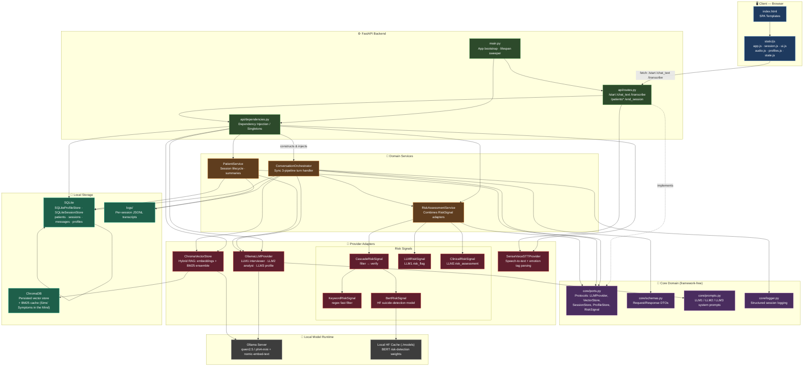
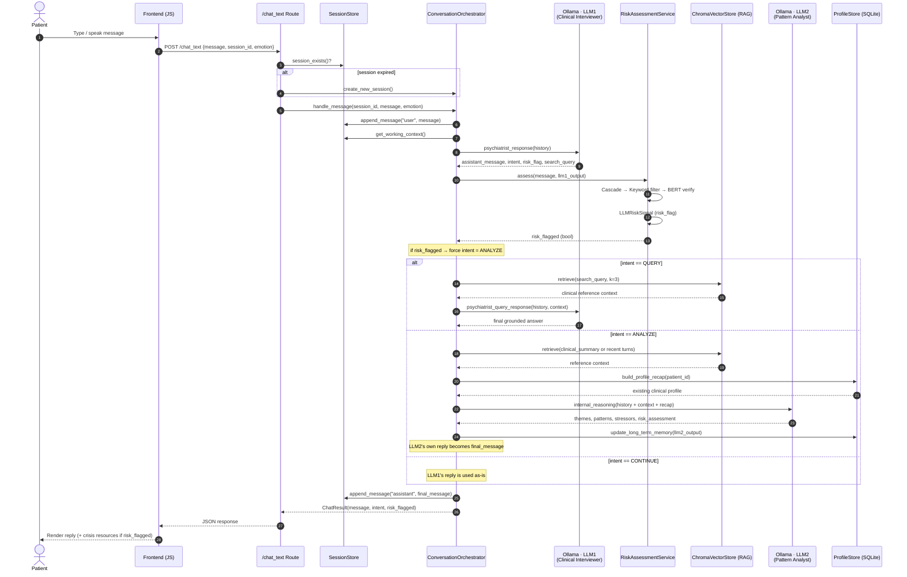

# Serinity — System Architecture & Workflow

Serinity is a **local-first, multi-agent conversational AI** for clinical mental-health interviews, built as a FastAPI backend with a hexagonal (ports & adapters) core, a vanilla-JS frontend, and fully offline model inference via Ollama.

---

## 1. System Architecture

The codebase follows a **ports & adapters** style: `core/ports.py` defines abstract interfaces (`LLMProvider`, `VectorStore`, `SessionStore`, `ProfileStore`, `STTProvider`, `RiskSignal`), `services/` contains the framework-free business logic, and `providers/` + `persistence/` supply concrete local implementations. `api/dependencies.py` wires everything together as singletons and injects them into the FastAPI routes.

**Key design points**

- **Hexagonal core**: `services/` never imports FastAPI or a concrete database driver — only the `Protocol` interfaces in `core/ports.py`. Any adapter (e.g. swap Ollama for another LLM host) can be replaced without touching business logic.
- **Singletons via DI**: `api/dependencies.py` builds every provider and service once at import time and exposes `get_*()` functions that FastAPI routes consume with `Depends(...)`.
- **100% local**: LLM inference (Ollama), embeddings (`nomic-embed-text`), the vector store (ChromaDB), the risk-detection BERT model, and all patient data (SQLite) run on-device — no data leaves the machine.

---

## 2. Chat Turn Workflow

Every user message flows through `ConversationOrchestrator.handle_message`, which runs a **synchronous 3-pipeline** logic: a fast conversational agent (LLM1), an optional query/RAG path, and an optional deep pattern-analysis agent (LLM2) — gated by intent and risk signals.

### Session lifecycle (start → end → background summary)

```mermaid
flowchart LR
    A["POST /start"] --> B["PatientService.create_new_session"]
    B --> C["ProfileStore.build_profile_recap"]
    C --> D["LLM1.generate_opening_context + psychiatrist_response"]
    D --> E["Opening message returned to patient"]

    E -.-> F["... chat turns via /chat_text ..."]

    F --> G["POST /end_session"]
    G --> H["SessionStore.end_session (sync)"]
    G --> I["BackgroundTasks: generate_session_summary"]
    I --> J["LLM3: generate_end_of_session_profile<br/>(old profile + session transcript)"]
    J --> K["ProfileStore.update_patient_profile<br/>+ update_long_term_memory"]
    J --> L["SessionStore.save_session_summary"]

    M["Lifespan Sweeper<br/>every 5 min"] --> N["sweep_abandoned_sessions<br/>(idle > 30 min)"]
    N --> G

    style A fill:#2d4a2b,stroke:#5cb85c,color:#fff
    style G fill:#5f1e2d,stroke:#e74c3c,color:#fff
    style J fill:#4a2d5f,stroke:#9b59b6,color:#fff
    style M fill:#3d3d3d,stroke:#bdbdbd,color:#fff
```

---

## 3. Component Reference

| Layer | File(s) | Responsibility |
|---|---|---|
| Entry point | `main.py` | FastAPI app, CORS, static mount, lifespan-managed session sweeper |
| API | `api/routes.py`, `api/dependencies.py` | HTTP endpoints + singleton wiring/DI |
| Core contracts | `core/ports.py`, `core/schemas.py`, `core/prompts.py`, `core/logger.py` | Protocols, DTOs, LLM prompt templates, structured logging |
| Orchestration | `services/conversation_orchestrator.py` | Per-turn pipeline: LLM1 → risk → QUERY/ANALYZE branch |
| Session lifecycle | `services/patient_service.py` | Start/end sessions, background LLM3 summary generation, idle sweeping |
| Risk | `services/risk_assessment_service.py`, `providers/*_risk_signal.py` | Multi-signal safety net (keyword → BERT cascade, LLM self-report, LLM2 clinical judgment) |
| LLM | `providers/ollama_llm_provider.py` | Local Ollama calls for LLM1 (interviewer), LLM2 (analyst), LLM3 (profile writer) |
| RAG | `providers/chroma_vector_store.py`, `scripts/build_vector_db.py` | Hybrid (embedding + BM25) retrieval over psychiatric reference text |
| Speech | `providers/sensevoice_stt_provider.py` | Audio → text + emotion/event tag parsing |
| Persistence | `persistence/sqlite_memory_store.py` | SQLite-backed `ProfileStore` and `SessionStore` |
| Frontend | `templates/index.html`, `static/js/*`, `static/css/style.css` | SPA: chat UI, mic recording, patient profile dashboard |

> Diagrams render automatically on GitHub/GitLab (Mermaid support built in) or in any Markdown viewer with Mermaid enabled, e.g. the [Mermaid Live Editor](https://mermaid.live).
